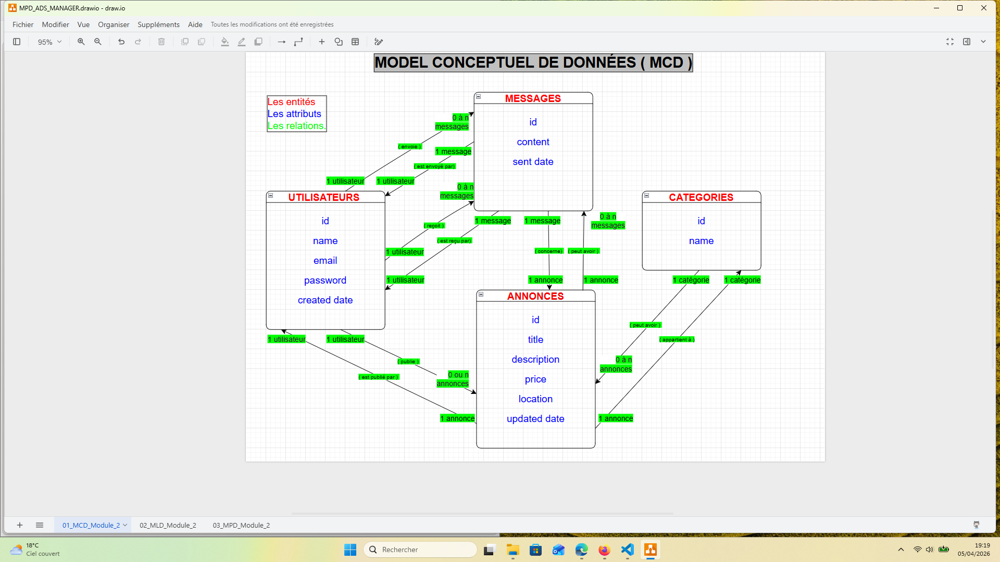
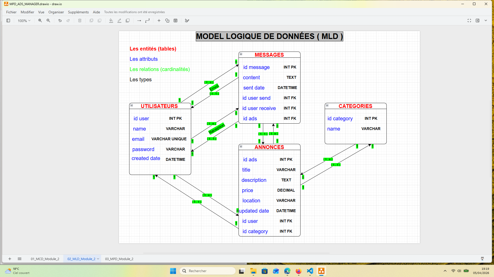
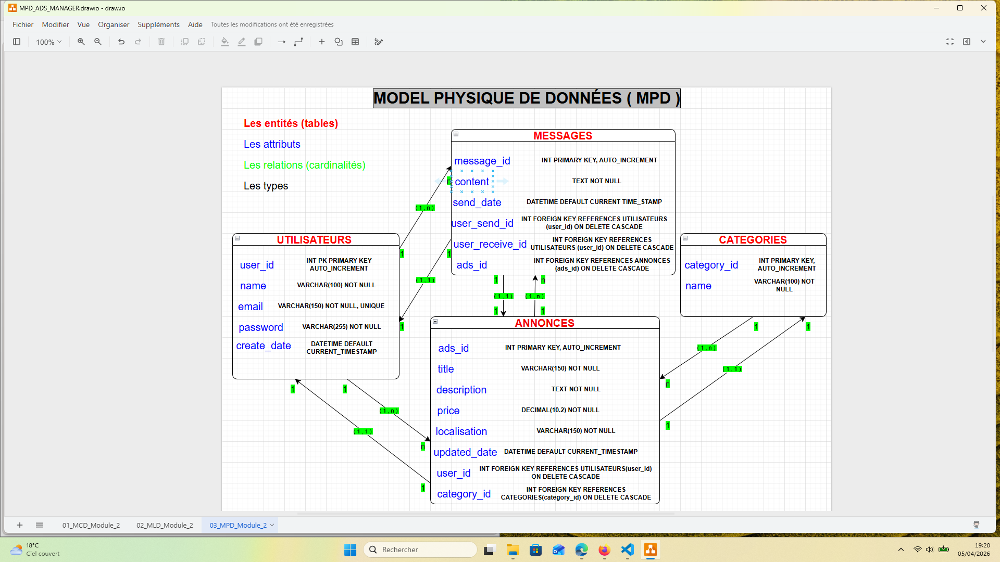
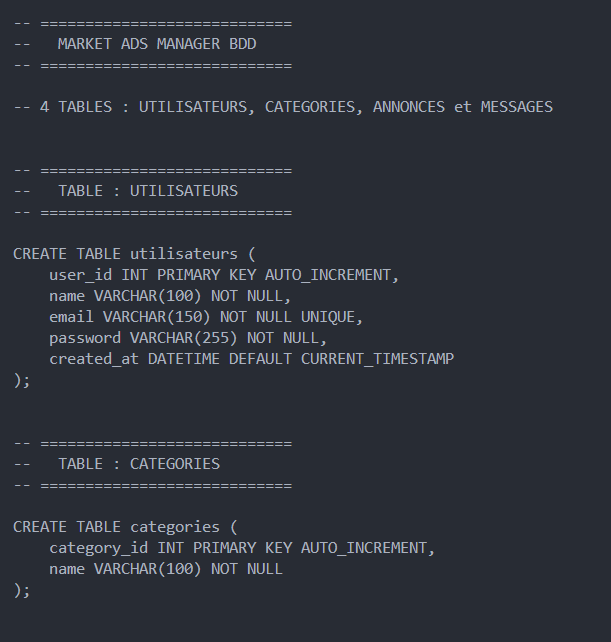
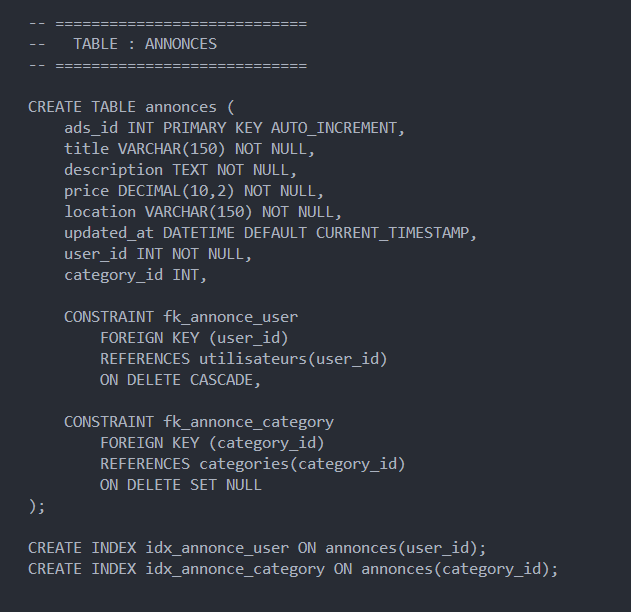
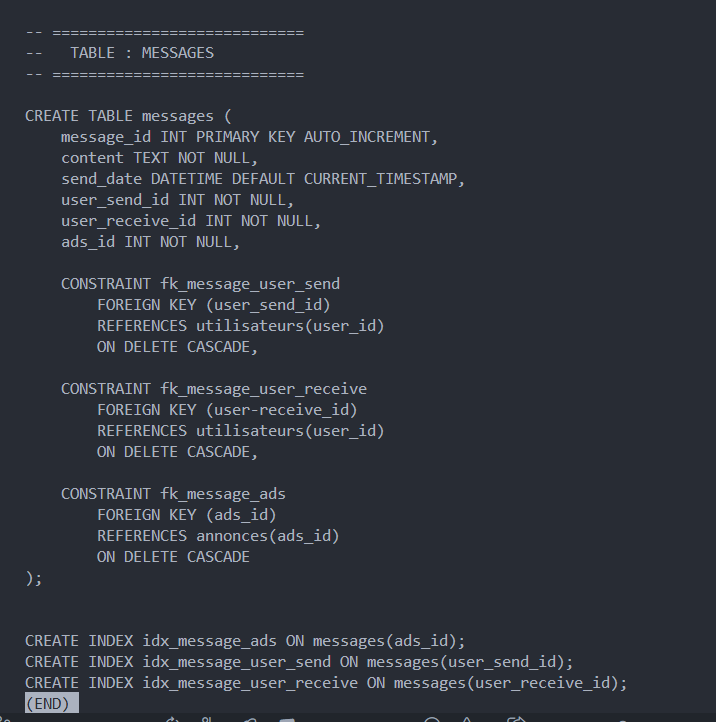

# MODULE 02 - CONCEPTION DE LA BASE DE DONNEES

## OBJECTIF DU MODULE

Concevoir la BDD du projet: **Market Ads Manager**, un site de petites annonces inspiré de « Le Bon Coin ».  
Ce module s’appuie sur les fonctionnalités définies dans le module 01 pour construire une base relationnelle complète et cohérente.

## Résumé de l'étude des besoins (voir module 01)

### Les besoins du site

Le site doit permettre :

- la gestion des utilisateurs,
- la publication et la consultation d’annonces,
- la classification des annonces par catégories,
- l’envoi de messages entre utilisateurs.

### Identification des entités nécessaire à la BDD

A partir des besoins, 4 entités ont pu être définis :

- UTILISATEURS
- ANNONCES
- MESSAGES
- CATEGORIES

### Les principes de fonctionnement

A partir des entités on peut déduire les possibilités permisent par le système :

- Un utilisateur publie plusieurs annonces.  
- Une annonce appartient à un seul utilisateur.  
- Une annonce appartient à 0 ou 1 catégorie.  
- Une catégorie peut contenir plusieurs annonces.  
- Un utilisateur envoie et reçoit plusieurs messages.  
- Un message concerne une seule annonce.

## Méthodologie

La conception suit les étapes classiques d'un modèle relationnel :

### 1. **MCD** - Modèle Conceptuel de données

Le MCD représente les entités principales du projet (Utilisateurs, Annonces, Messages, Catégories) ainsi que leurs relations.

### 2. **MLD** - Modèle Logique de données

Le MLD traduit le MCD en tables relationnelles, avec les clés primaires, clés étrangères et types généraux.

### 3. **MCPD** - Modèle Physique de données

Le MPD correspond à la structure SQL finale : types SQL précis, contraintes, index et relations.

### 4. **Script SQL** - Création de la base de données

Le schéma SQL représente la structure complète de la base de données telle qu’elle est générée par le script SQL :  
tables, clés primaires, clés étrangères, types SQL, contraintes et index.

## Outils et Ressources

- Draw.io / diagramms.net : [https://app.diagrams.net]
- MySQl : [https://dev.mysql.com/downloads/mysql/]
- SQL : [https://sqlbolt.com]
- MongoDB : [https://www.mongodb.com/docs]
